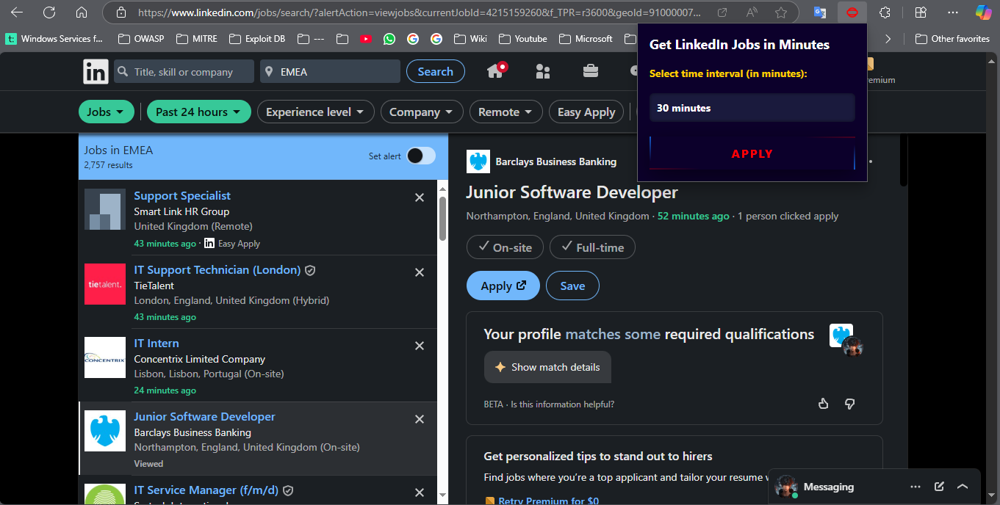

# 🔍 Get LinkedIn Jobs in Minutes

A simple Chrome/Edge browser extension that lets you quickly filter LinkedIn job postings by how recently they were posted (in just **1 to 60 minutes**).

## 🚀 Features

- ⏱ Set custom time intervals (in minutes) from 1 to 60
- 🔗 Automatically updates the `f_TPR` URL parameter on LinkedIn job search pages
- 🎨 Sleek animated UI with glowing button style
- 💡 Great for job seekers who want real-time job updates

## 🖼️ Preview



## 📦 Files Structure

```bash
├── background.js
├── icon.png
├── LICENSE
├── manifest.json
├── popup.html
├── popup.js
├── preview.png
├── PRIVACY.md
└── README.md

file: 9
```
## 🧩 How to Install (Developer Mode)

1. Download or clone this repository:
   ```bash
   git clone https://github.com/0MARr00t/getinm.git
   ```

2. Open **Chrome** or **Edge** and go to:
   ```
   chrome://extensions/   (or edge://extensions/)
   ```

3. Enable **Developer mode**

4. Click **"Load unpacked"** and select the extension folder

5. Done! Click the extension icon and start filtering jobs 🚀

## 🛠️ Tech Used

- HTML5 + CSS3
- JavaScript (Vanilla)
- WebExtension APIs (Chrome-compatible)

## 📄 License

This project is licensed under the [MIT License](LICENSE).

---

Built with 💙 to help job seekers get hot results.

---